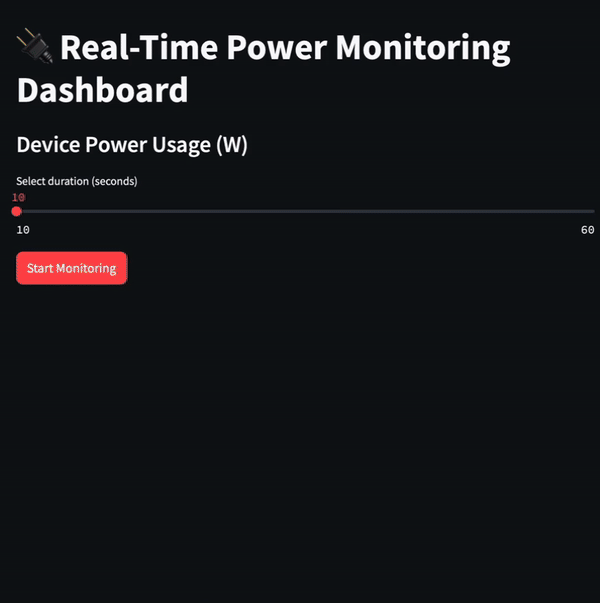

# Real-Time Power Monitoring Dashboard 🚀

This project simulates and visualizes real-time power usage for smart devices using **Python** and **Streamlit**.

## Features
- 🔌 Simulates power usage for devices: **Fridge**, **Air Conditioner**, and **Smart Light**.
- 📊 Real-time interactive line charts showing power consumption trends.
- 🛠 Built with **Python**, **Streamlit**, and **Matplotlib**.

## Installation
Follow these steps to run the project on your local machine:

1. **Clone the repository**:
   ```bash
   git clone https://github.com/bryanmalak/real-time-power-monitoring.git
   cd real-time-power-monitoring

## Demo


## Future Enhancements

- Integration with real hardware like Arduino or Raspberry Pi for live power monitoring.
- Data export functionality for energy usage reports.