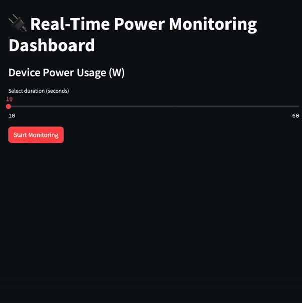

# Real-Time Power Monitoring Dashboard 🚀

This project provides a real-time simulation and visualization of energy usage for smart devices. Built with Python, Streamlit, and Matplotlib, it demonstrates the potential for monitoring and analyzing energy consumption trends in a modern, interactive dashboard.

## Key Features 🌟
🔌 Device Simulation – Models power usage for smart devices like a Fridge, Air Conditioner, and Smart Light.
📊 Interactive Charts – Real-time, dynamic line charts visualize energy consumption trends instantly.
🛠 Modern Tech Stack – Built with Python, Streamlit, and Matplotlib for scalability and performance.
📈 Custom Monitoring Options – Adjustable timeframes allow flexible data visualization and monitoring.

## Installation
Follow these steps to run the project on your local machine:

1. **Clone the repository**:
   ```bash
   git clone https://github.com/bryanmalak/real-time-power-monitoring.git
   cd real-time-power-monitoring

## Demo


## Future Enhancements

- Integration with real hardware (Arduino or Raspberry Pi) for live power monitoring.
- Data export functionality for energy usage reports.
